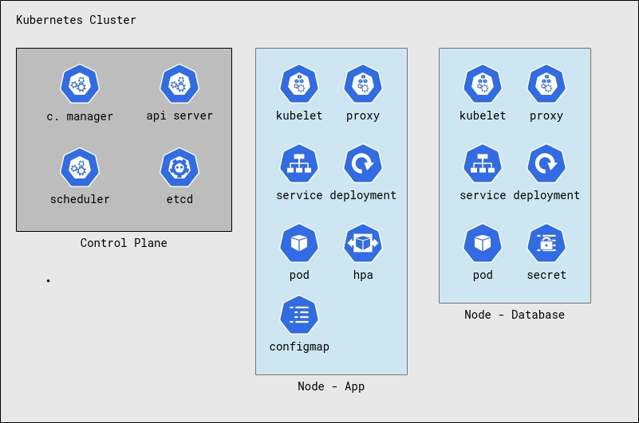

# Install

## Requirements

- A kubernetes cluster (e.g. [Minikube](https://minikube.sigs.k8s.io/docs/))
- [Helm](https://helm.sh/docs/)

## How to install (Helm/Kubernetes)

There are two ways to install the application: using the prebuilt helm chart or building the chart from the templates.

### Using the prebuilt chart

- Clone the repository
- `helm install fastfood oci://docker.io/marcostmunhoz/fiap-tech-challenge-fastfood-helm`

### Building the chart

- Clone the repository
- `helm install fastfood helm`

The installed application will have the following components:

### Accessing the application

If you're running the application in a cloud provider, the service will be exposed as a LoadBalancer. You can access the application using the LoadBalancer IP.

If you're running the application in Minikube, you can access the application using the command `minikube service fastfood-fiap-tech-challenge-fastfood-helm-monolith-service --url`. The application will be available at the URL provided by the command.

## How to uninstall (Helm/Kubernetes)

- `helm uninstall fastfood`

## Docker Compose

Alternatively, you can run the application using Docker Compose. To do this, run `docker compose up -d` in the root of the project. The application will be available at `http://localhost:3000`.
