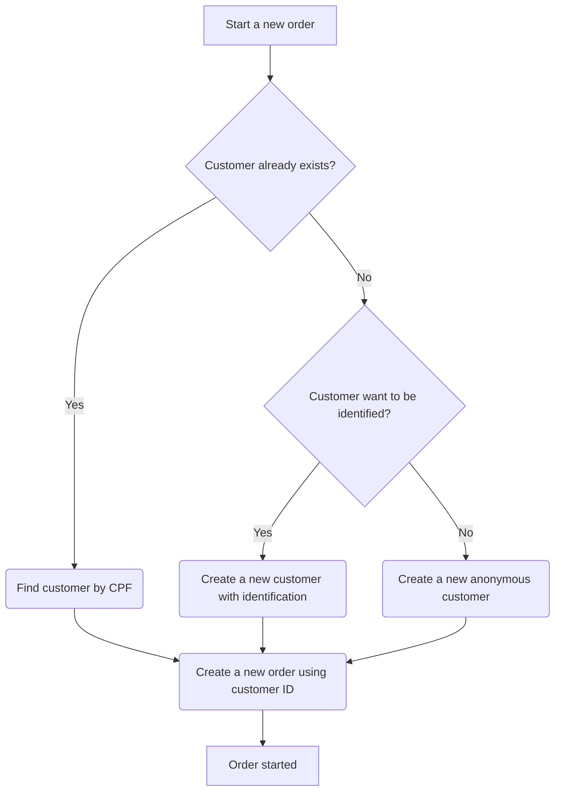
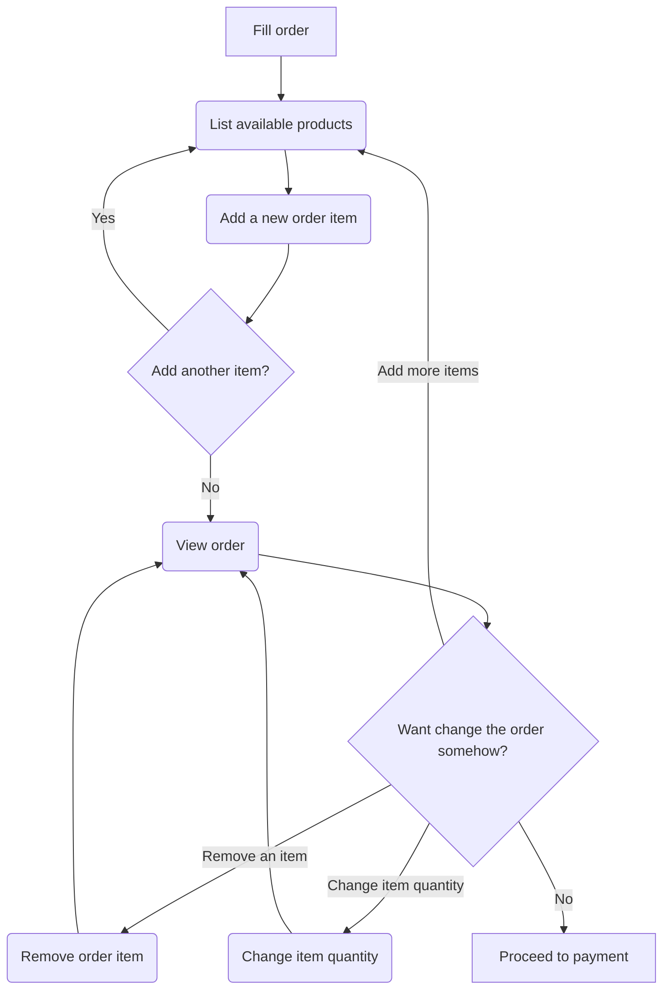
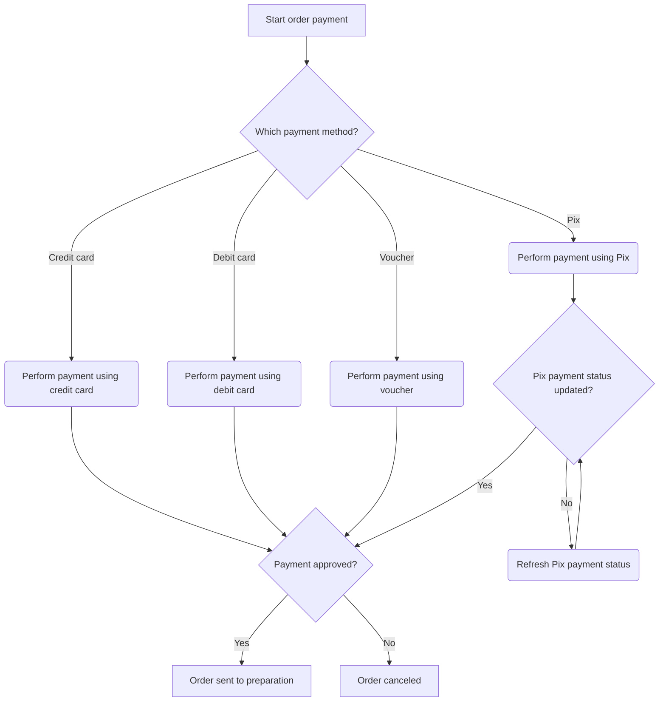
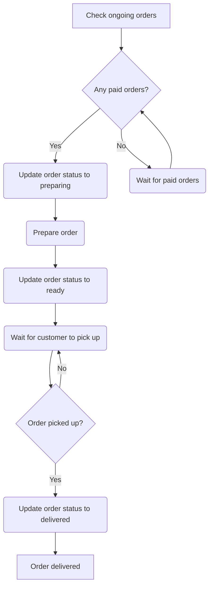

# Usage

Once the application is running, you can start using it by following the steps below.

## Start a new order

To start a new order, you need to have a customer ID. If the customer is already registered, you can find it by its CPF. If not, you can create a new customer.

- Find customer by CPF: [GET /api/v1/customers/{cpf}](http://localhost:3000/api/docs#/Customers/FindCustomerByCpfController_execute)
- Create a new customer with identification/create a new anonymous customer: [POST /api/v1/customers](http://localhost:3000/api/docs#/Customers/CreateCustomerController_execute)
- Create a new order using customer ID: [POST /api/v1/orders](http://localhost:3000/api/docs#/Orders/CreateOrderController_execute)

### Tips for development environment:

- The customer ID edd93592-550c-4c01-9966-f91c60b9cca3 can be used for an identified customer (CPF 66894662053).
- The customer ID c091b4b6-ed8f-4bef-b5da-e2981646a5cc can be used for an anonymous customer.

## Filling the order

Once you have the order ID, you can start filling it with products.

- List available products: [GET /api/v1/orders/products](http://localhost:3000/api/docs#/Orders/ListProductsController_execute)
- Add a product to the order: [POST /api/v1/orders/{id}/add-item](http://localhost:3000/api/docs#/Orders/AddOrderItemController_execute)
- View order: [GET /api/v1/orders/{id}](http://localhost:3000/api/docs#/Orders/ShowOrderController_execute)
- Remove order item: [POST /api/v1/orders/{id}/remove-item](http://localhost:3000/api/docs#/Orders/RemoveOrderItemController_execute)
- Change item quantity: [POST api/v1/orders/{id}/change-item-quantity](http://localhost:3000/api/docs#/Orders/ChangeOrderItemQuantityController_execute)

### Tips for development environment:

- There are 13 sample products, divided into 4 categories: food, drink, dessert, and side.

## Performing the order payment

After filling the order, you can proceed to payment.

- Perform a payment (any payment method): [POST /api/v1/payments](http://localhost:3000/api/docs#/Payments/CreatePaymentController_execute)
- Refresh Pix payment status: [POST /api/v1/payments/{id}/refresh-status](http://localhost:3000/api/docs#/Payments/RefreshPaymentStatusController_execute)

### Tips for development environment:

- Card payments (credit-card, debit-card, or voucher) are automatically approved when the card number is "1111222233334444". For other numbers, they are rejected (simulating a payment failure).
- Pix payments are always created with a pending status and subsequently updated via the refresh-status request. Alternatively, the pending ones are automatically approved (by a simulated webhook) every minute.

## Order preparation (kitchen)

After the payment is approved, the order is sent to the kitchen for preparation.

- List ongoing orders: [GET /api/v1/orders](http://localhost:3000/api/docs#/Orders/ListOrdersController_execute)
- Update order status: [PUT /api/v1/orders/{id}/status](http://localhost:3000/api/docs#/Orders/UpdateOrderStatusController_execute)

### Tips for development environment:

- There are 6 sample orders, with different status (canceled, pending, paid, preparing, ready, and delivered).
- There are also 6 sample payments, with the corresponding payment status (e.g. the canceled order has failed payment).

## Product management (kitchen)

The kitchen can also manage products (list, view, create, update and delete).

- List/search registered products: [GET /api/v1/products](http://localhost:3000/api/docs#/Products/SearchProductsController_execute)
- View a product: [GET /api/v1/products/{id}](http://localhost:3000/api/docs#/Products/ShowProductController_execute)
- Register a product: [POST /api/v1/products](http://localhost:3000/api/docs#/Products/CreateProductController_execute)
- Edit a product: [PUT /api/v1/products/{id}](http://localhost:3000/api/docs#/Products/UpdateProductController_execute)
- Delete a product: [DELETE /api/v1/products/{id}](http://localhost:3000/api/docs#/Products/DeleteProductController_execute)

## Additional endpoints

- Check application status: GET /health
- Simulate an webhook: [POST /api/v1/payments/invoice-event](http://localhost:3000/api/docs#/Payments/InvoiceEventController_execute)
- Simulate a load: GET /api/v1/load?level=numberBetween1And50 (note that this endpoint uses a fibonacci sequence to simulate a load, so it may take a while to respond depending on the "level" used)
